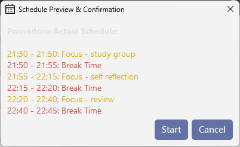

FocusFlow

A desktop task scheduling and Pomodoro timer application built with Python and PyQt6.

Read this document in 繁體中文 (Traditional Chinese)

Features
Weekly Task Scheduling: Plan your tasks for the upcoming seven days on a clear, scrollable interface.

Integrated Pomodoro Timer: Automatically creates a continuous work-rest schedule based on today's tasks. The timer seamlessly transitions from one task to the next.

Dynamic Schedule Generation: The application intelligently finds the next upcoming task and builds a continuous workflow, ensuring no time is wasted. If all tasks for the day have passed, it offers to restart from the beginning.

Customizable Modes: Supports multiple preset Pomodoro timers (e.g., 20/5, 25/10) and allows users to define custom work/break durations.

Multi-Language Support: The UI is available in Traditional Chinese, English, and Japanese.

Desktop Notifications: Provides non-intrusive desktop notifications for the start of work and break sessions.

Persistent Storage: All schedules are saved locally in a pomodoro_schedule.json file, automatically loading your tasks on the next launch.

User Interface
Setup & Installation
1. Prerequisites

Python 3.8+

2. Clone the Repository

git clone [https://github.com/StephenwwW/Focus_Flow.git](https://github.com/StephenwwW/Focus_Flow.git)
cd Focus_Flow

3. Install Dependencies

It is highly recommended to use a virtual environment.

# Create and activate a virtual environment (optional but recommended)
python -m venv venv
source venv/bin/activate  # On Windows, use `venv\Scripts\activate`

# Install required packages
pip install -r requirements.txt

How to Use
Run the application from the project's root directory:

python main.py

Add tasks for any day within the 7-day view. Specify the task name and its planned start time.

Select your preferred Pomodoro mode from the dropdown menu.

Click the "Preview & Start Today's Pomodoro" button to review the generated schedule and begin your focus session.

License
This project is released under the MIT License.

 

FocusFlow (繁體中文)

一款使用 Python 和 PyQt6 開發的桌面番茄鐘與任務排程應用程式。

View this document in English

功能特色
週任務排程: 在清晰的滾動介面中，規劃未來七天的任務。

整合式番茄鐘: 根據當日任務，自動建立一個連續不斷的工作-休息排程。計時器會在任務之間無縫切換。

動態排程生成: 程式會智慧地尋找下一個即將開始的任務，並以此為起點建立連續的工作流，確保時間不被浪費。若當日所有任務時間皆已過去，程式會詢問是否從頭開始。

可自訂模式: 支援多種預設的番茄鐘模式（例如 20/5、25/10），並允許使用者自訂工作與休息的時間長度。

多國語言支援: 使用者介面支援繁體中文、英文及日文。

桌面通知: 在工作與休息時段開始時，提供非侵入式的桌面通知。

本地化儲存: 所有排程都會儲存在本地的 pomodoro_schedule.json 檔案中，並在下次啟動時自動載入。

## 軟體截圖

環境設定與安裝
1. 前置需求

Python 3.8 或更新版本

2. 複製專案

git clone [https://github.com/StephenwwW/Focus_Flow.git](https://github.com/StephenwwW/Focus_Flow.git)
cd Focus_Flow

3. 安裝依賴套件

強烈建議在虛擬環境中進行安裝。

# 建立並啟用虛擬環境 (選用但建議)
python -m venv venv
source venv/bin/activate  # Windows 使用 `venv\Scripts\activate`

# 安裝所需套件
pip install -r requirements.txt

如何使用
在專案根目錄下執行主程式：

python main.py

在七日視圖中為任何一天新增任務，指定任務名稱與預計開始時間。

從下拉選單中選擇您偏好的番茄鐘模式。

點擊「預覽並啟動今日番茄鐘」按鈕，即可檢視生成的排程並開始您的專注時光。

授權條款

本專案採用 MIT 授權條款。
